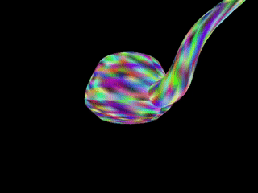
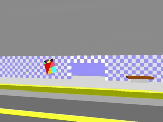
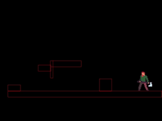
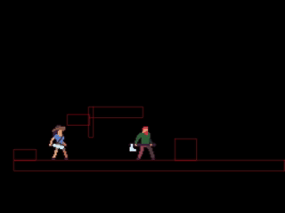

# 🖥️ superdisplay
Started: Feburary 27th, 2026  
Last Updated: June 16th, 2026  

## 📝 About
superdisplay is a barebones CPU rendering pipeline. This project is being written in C++ with help from the SDL3 development library for its user input and display capabilities.  

| Version | Demo Video |
|----------|------------|
| superdisplay stable versions 1 and 5 |   |
| platformprogram tests |   |

superdisplay has its uses as a low-level game platform. Currently, it is being used in the development of a platform fighting game which has occasional postings in this repository. Demo videos of what the platform fighter looks like can be found above.  

## ⬇️ Installation
Download `superdisplay_stable5_source.zip` for the latest version. Make sure to extract the files from the .zip before trying to run the program.  

When you run the .exe for the first time, Windows Defender might pop up and prevent you from running, as the program is from an unknown publisher. To get around this, click "Learn More", and then "Run Anyways".   

All the .dll files should be included in the directory of the .exe. If there is one missing please let me know.  

## ⚙️ Running
This program uses the Wavefront .obj file type to import meshes. In the `settings/importfile.txt` document, type in the `import`, followed by the directory and file name to import the mesh.

For instance, if this was the file structure:

superdisplay_stable3_source
- superdisplay.exe
- mymesh1.obj
- /myfolder/mymesh2.obj

I would use `import "./mymesh1.obj"` or `import "./myfolder/mymesh2.obj"` to import it.

## 📩 Contact Information
Author: Kai Pearson  
Email: kaipearson@dal.ca  
GitHub: pearson-kai  
